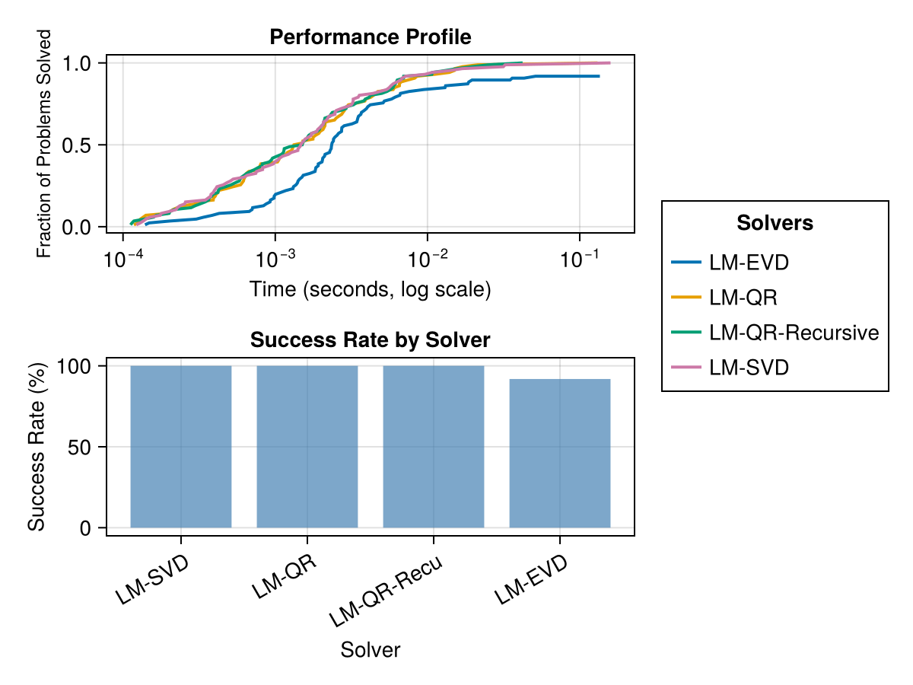
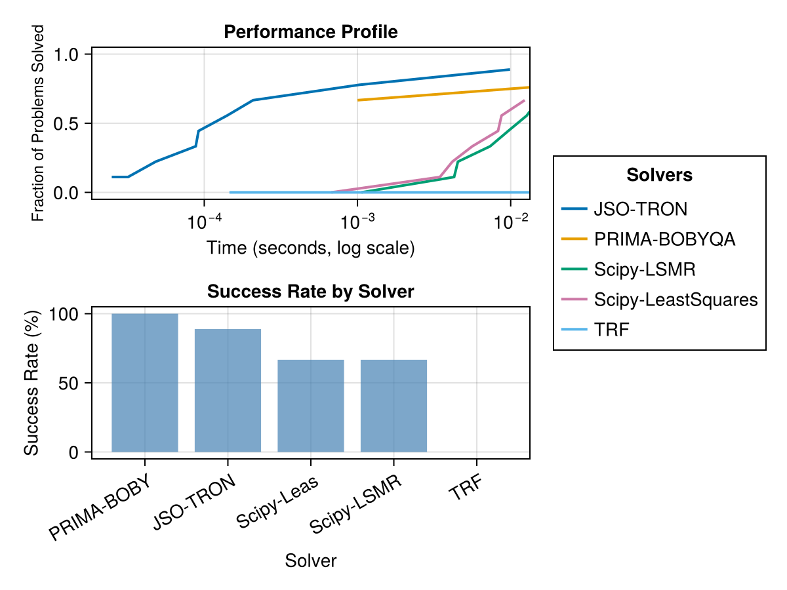

# nonlinearlstr.jl

[](https://github.com/vcantarella/nonlinearlstr.jl/actions/workflows/CI.yml?query=branch%3Amain)

A robust and efficient Julia package for solving **Nonlinear Least Squares (NLLS)** problems using Trust Region methods. It supports both unconstrained and bound-constrained optimization with modern, stable numerical linear algebra techniques.

## Features

- **Unconstrained NLLS**: Levenberg-Marquardt style Trust Region algorithm.
- **Bounded NLLS**: Trust Region Reflective algorithm using Coleman-Li scaling.
- **Robust Subproblem Solvers**:
    - **Recursive QR**: High-performance solver that efficiently updates factorizations (Default).
    - **Standard QR**: Numerically stable solver using column-pivoted QR.
    - **SVD**: Maximum robustness for ill-conditioned Jacobians.
- **Allocation-Free Hot Paths**: Optimized for performance with aggressive buffer reuse.

## Installation

```julia
using Pkg
Pkg.add(url="https://github.com/vcantarella/nonlinearlstr.jl")
```

## Usage

### Unconstrained Optimization

Use `lm_trust_region` for standard NLLS problems.

```julia
using nonlinearlstr, LinearAlgebra

# 1. Define Residual Function (f: R^n -> R^m)
function rosenbrock_res(x)
    return [10.0 * (x[2] - x[1]^2), 1.0 - x[1]]
end

# 2. Define Jacobian Function (J: R^n -> R^{m x n})
function rosenbrock_jac(x)
    return [-20.0 * x[1] 10.0; -1.0 0.0]
end

# 3. Solve
x0 = [-1.2, 1.0]
x_opt, f_opt, g_opt, iter = nonlinearlstr.lm_trust_region(
    rosenbrock_res,
    rosenbrock_jac,
    x0,
    nonlinearlstr.QRrecursiveSolve() # Strategy (Optional, Default is SVDSolve in some versions but Recursive is recommended)
)

println("Solution: ", x_opt)
```

### Bound-Constrained Optimization

Use `lm_trust_region_reflective` for problems with box constraints (`lb <= x <= ub`).

```julia
# 4. Solve with Bounds
lb = [-2.0, -2.0]
ub = [0.5, 0.5] # Constraint forces solution away from global minimum (1,1)

x_opt_bounded, _, _, _ = nonlinearlstr.lm_trust_region_reflective(
    rosenbrock_res,
    rosenbrock_jac,
    x0;
    lb = lb,
    ub = ub
)

println("Bounded Solution: ", x_opt_bounded)
```

## Methodology

### Trust Region Framework
The core of the package is a Trust Region framework. At each iteration, the algorithm constructs a quadratic model of the objective function `F(x) = 0.5 * ||f(x)||^2` around the current point `x_k`:
```math
min_p  || J_k p + f_k ||^2  \quad \text{subject to} \quad || D_k p || \le \Delta_k
```
where `J_k` is the Jacobian, `f_k` are residuals, `D_k` is a scaling matrix, and `\Delta_k` is the trust region radius.

### Solving the Subproblem
The constrained subproblem is equivalent to solving the regularized linear system:
```math
(J_k^T J_k + \lambda D_k^T D_k) p = -J_k^T f_k
```
for a specific Lagrange multiplier `\lambda \ge 0`.

`nonlinearlstr.jl` solves this efficiently by searching for `\lambda` using Newton\'s method. The factorization (QR or SVD) of `J` is computed once per iteration (or updated) and reused to solve the linear system for different candidate `\lambda` values during the subproblem search.

### Handling Bounds (Coleman-Li)
For bound-constrained problems, the package implements the **Trust Region Reflective** method. It uses the scaling matrix `D_k` proposed by Coleman and Li, which incorporates distance to the bounds. This ensures that the descent direction steers away from bounds as they are approached, effectively keeping the iterate strictly feasible (or on the boundary) without complex active-set management.

## Benchmarks

Benchmarks verify the performance of `nonlinearlstr` against standard test sets (CUTEst, NLSProblems).

### Unconstrained Solver Performance
Performance profile comparing different internal strategies on a set of NLLS problems.
- **LM-QR-Recursive**: Uses the optimized recursive QR update.
- **LM-QR**: Uses standard pivoted QR.
- **LM-SVD**: Uses Singular Value Decomposition.


*Figure 1: Performance profile on general NLLS problems. Higher curves indicate better performance (solving more problems within a factor of the best time).*

### Bounded Solver Performance
Comparison of the Trust Region Reflective (TRF) implementation against other solvers on hard bounded problems.


*Figure 2: Performance profile on bound-constrained NLLS problems.*

## Status
This package is currently in development and intended for testing robust NLLS implementations. It aims to provide a reliable reference implementation for trust-region methods in Julia.